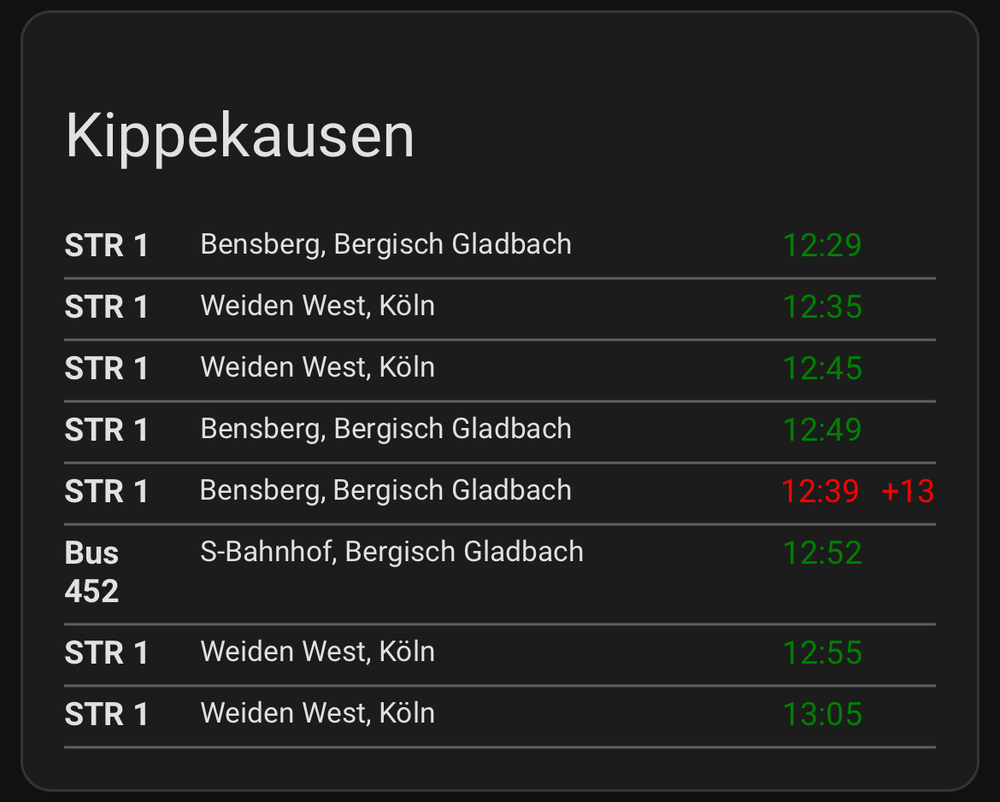
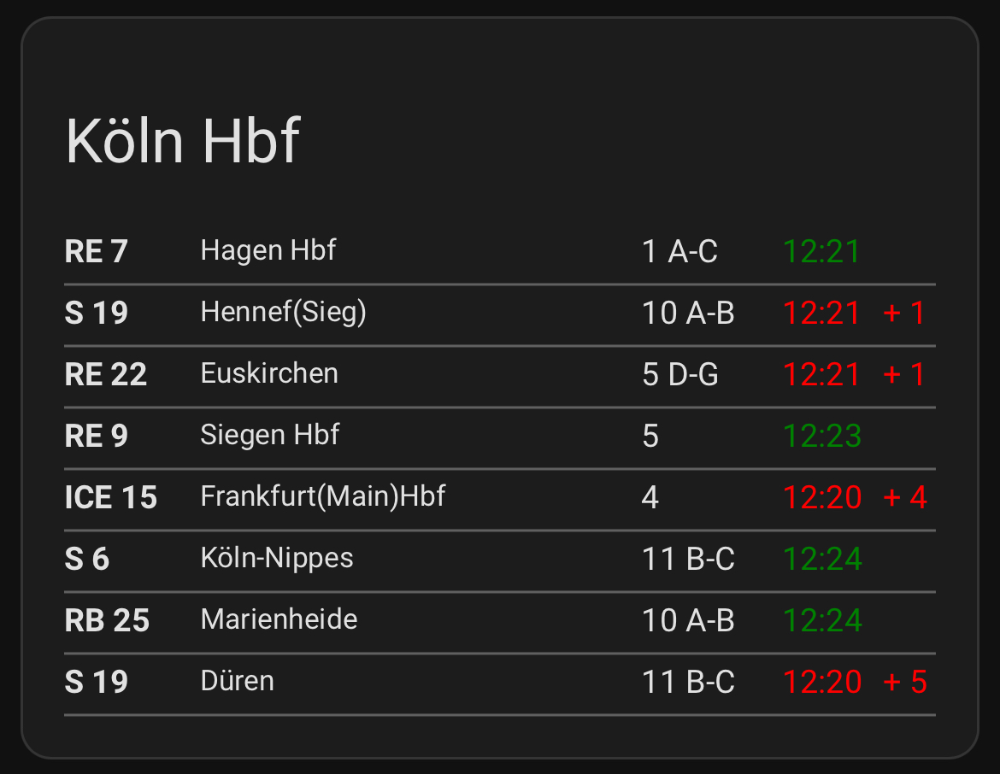

# Custom Departure Card for Home Assistant
This custom-card is based on the integration [ha-db_infoscreen](https://github.com/FaserF/ha-db_infoscreen/) developed by [FaserF](https://github.com/FaserF). 





## HACS Installation (recommended)

[](https://my.home-assistant.io/redirect/hacs_repository/?owner=BagelBeef&repository=ha-departureCard)

If you use this method your departureCard will always update to the newest version.

## Manual Installation

To install this custom card, follow these steps:
	
 1.	Download the card’s JavaScript file and add it to the /www/ directory in your Home Assistant instance.
	
 2.	Add the path to this card to your dashboard ressources (options -> dashboard -> three dots -> ressources):

resources:
  - url: /local/departureCard.js
    type: javascript-module

	
 3.	Use the example configuration above in your dashboard (manual yaml-configuration).

# Have fun!

## Card Configuration

The following example demonstrates how to configure the card in your dashboard. 

```yaml
type: custom:departure-card
title: Köln Hbf
entity: sensor.koln_hbf_departures
connections_attribute: next_departures
displayed_connections: 8
unix_time: false
convertTimeHHMM: false
connection_properties:
  targets: null
  train: train
  platform: platform
  show_platform: true
  departure: scheduledDeparture
  delay: delayDeparture
```

## Parameters Explained

### type
Specifies the type of card to display.

### title
The title displayed at the top of the card.

Example: Köln Hbf

### connections_attribute
The attribute within the sensor data that holds the list of departures.

Example: next_departures

### displayed_connections
The number of connections (departures) to display.

Example: 8

### unix_time
Boolean flag that determines whether to convert Unix time format for timestamps. Check your sensor. If it shows something like 1737619740 it's unix-time.  

Example: false

### convertTimeHHMM
Sometimes the timestamp given by the api appears like this "2025-01-26 20:12:00". Set convertTimeHHMM: true if you want to convert those timestamps into HH:MM.

Example: false

## connection_properties

Defines how each departure is displayed and which properties are included.

### targets
Targets for the connection. If no specific target is needed, set it to null.

Example: null

### train
The attribute from the sensor data that represents the train information.

Example: train

### platform
The attribute from the sensor data where the train departs from.

Example: platform

### show_platform
Boolean flag to specify whether the platform number should be shown or not.

Example: true

### departure
The attribute from the sensor data that contains the scheduled departure time of the train.

Example: scheduledDeparture

### delay
The attribute from the sensor that represents the delay of the departure.

Example: delayDeparture

### entity
The entity ID of the sensor that contains the departure data.

Example: sensor.koln_hbf_departures

